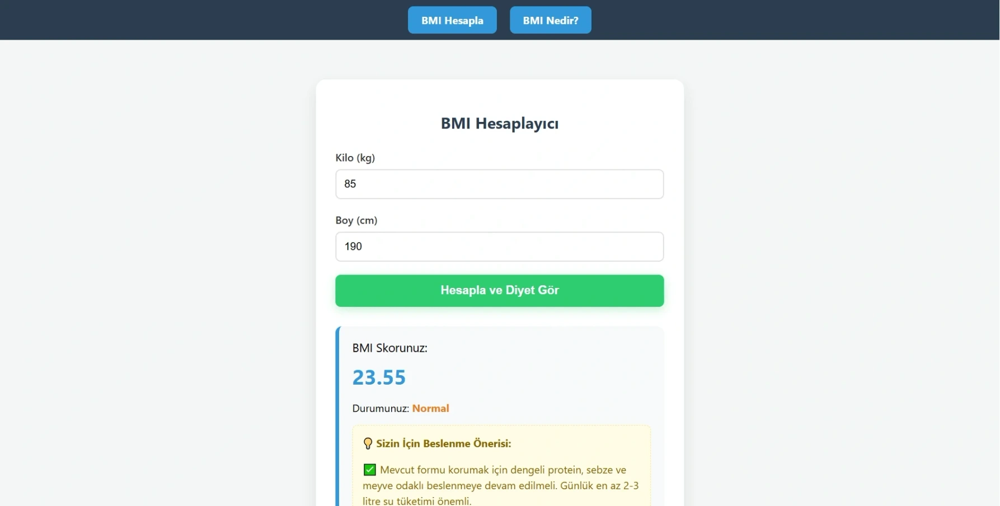

# vucut-kitle-endeksi-hesaplama

React • Vite • Styled Components • React Router • LocalStorage • Hooks App

---

[See The Project](https://akvucutkitleendeksihesaplama.netlify.app/)

---



---

Bu proje, kullanıcıların boy ve kilo bilgilerini girerek **Vücut Kitle Endeksi (BMI)** değerlerini hesaplamalarını sağlayan modern bir web uygulamasıdır. Hesaplama sonucuna göre kullanıcıya özel **diyet listesi önerileri** sunulur ve veriler **localStorage** ile tarayıcıda saklanır.

### 🚀 Özellikler

- **Hassas BMI Hesaplama:** Boy ve kilo verileri kullanılarak anlık hesaplama yapılır.
- **Kişiselleştirilmiş Diyet Listesi:** Hesaplama sonucuna göre (Zayıf, Normal, Kilolu, Obez) kullanıcıya uygun beslenme önerileri görüntülenir.
- **Veri Kalıcılığı:** `localStorage` entegrasyonu sayesinde sayfa yenilendiğinde son hesaplama verileri korunur.
- **URL Senkronizasyonu:** React Router kullanılarak "Hesaplama" ve "BMI Nedir?" sayfaları arasında kesintisiz geçiş sağlanır.
- **Modern Arayüz:** `Styled Components` kullanılarak geliştirilmiş, responsive ve yüksek performanslı tasarım.

### 🛠️ Teknoloji Yığını

- **Frontend:** React 18+ (Vite)
- **Styling:** Styled Components
- **Yönlendirme:** React Router DOM
- **Hooks:** useState, useEffect (State & Lifecycle yönetimi)
- **Depolama:** Browser LocalStorage API

### 📋 Gereksinimler

- Node.js (v18+)
- npm veya yarn

### 🔧 Kurulum ve Çalıştırma

```bash
git clone https://github.com/alperenkursun/vucut-kitle-endeksi-hesaplama.git
cd vucut-kitle-endeksi-hesaplama
yarn install
yarn dev
```

---

[Frontend Web Development Projeleri](https://academy.patika.dev/courses/frontend-web-development-projeleri/bmi)

[Patika](https://academy.patika.dev/tr/@alpk)
